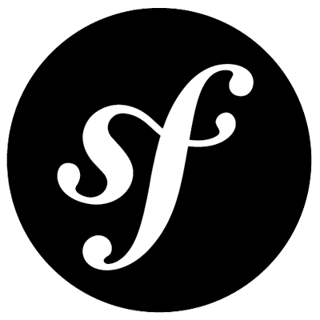
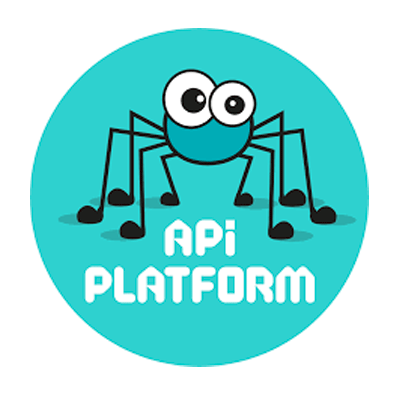
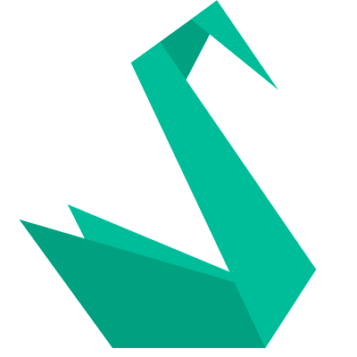
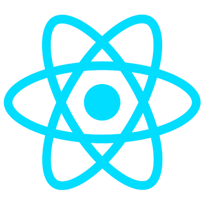
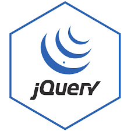
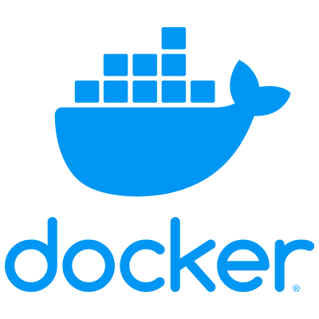
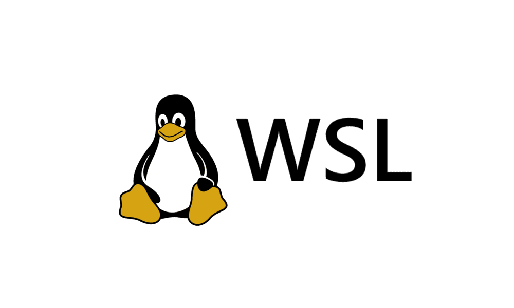

<!--
**idealyhenintsoagithub/idealyhenintsoagithub** is a ✨ _special_ ✨ repository because its `README.md` (this file) appears on your GitHub profile.

Here are some ideas to get you started:

- 🔭 I’m currently working on ...
- 🌱 I’m currently learning ...
- 👯 I’m looking to collaborate on ...
- 🤔 I’m looking for help with ...
- 💬 Ask me about ...
- 📫 How to reach me: ...
- 😄 Pronouns: ...
- ⚡ Fun fact: ...
-->

<h2 align="center">Hi👋 i'm idealy henintsoa</h2>

I am a passionate software developer with a strong background in building robust and scalable applications. My expertise covers both backend and frontend development, allowing me to deliver complete solutions tailored to project needs. I am always eager to learn new technologies and improve my skills to stay up-to-date with the latest trends in software engineering.

For backend development, I primarily use Symfony and API Platform to create powerful RESTful APIs and web services. These frameworks enable me to design secure, maintainable, and high-performance server-side applications. On the frontend, I leverage React and Flutter to craft responsive and engaging user interfaces for both web and mobile platforms.

My daily toolkit includes Visual Studio Code for efficient coding, GitHub and GitLab for version control and collaboration, and Docker for containerization and environment management. These tools help me streamline development workflows and ensure consistency across different stages of the project lifecycle.

I am comfortable working across multiple operating systems, including WSL, Ubuntu, and Windows. This flexibility allows me to adapt to various development environments and collaborate seamlessly with diverse teams.

Whether working independently or as part of a team, I am committed to delivering high-quality software solutions. I enjoy tackling complex challenges and am always open to new opportunities for collaboration and growth in the tech community.

<h3>Those are my tech stack</h3>

  
  
  
  
  
  
  

<h3>My tools</h3>

  
  
  
  

<h3>My OS</h3>

  
  
  

